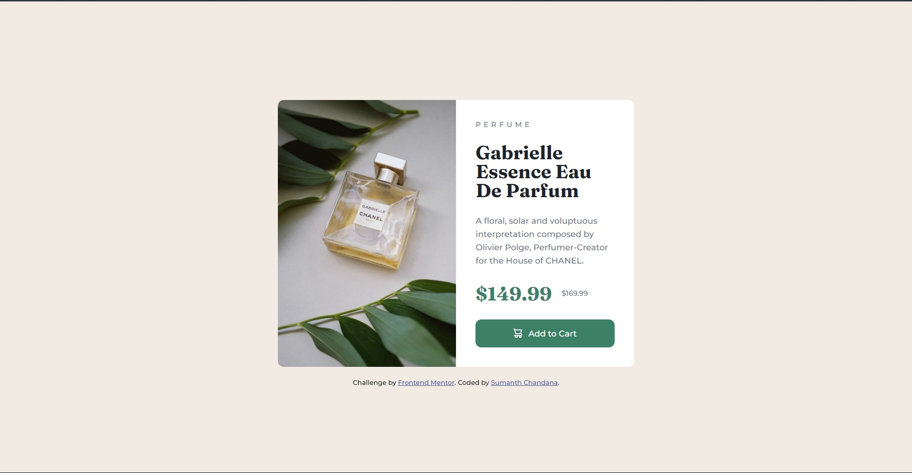

# Frontend Mentor - Product preview card component solution

This is a solution to the [Product preview card component challenge on Frontend Mentor](https://www.frontendmentor.io/challenges/product-preview-card-component-GO7UmttRfa). Frontend Mentor challenges help you improve your coding skills by building realistic projects. 

## Overview

### The challenge

Users should be able to:

- View the optimal layout depending on their device's screen size
- See hover and focus states for interactive elements

### Screenshot
| desktop | mobile |
| --- | --- |
|  |  |

### Links

- Solution URL: [https://github.com/sumanth-chandana/product-review-card-component.git](https://github.com/sumanth-chandana/product-review-card-component.git)
- Live Site URL: [https://sumanth-chandana.github.io/product-review-card-component/](https://sumanth-chandana.github.io/product-review-card-component/)

## My process

### Built with

- Semantic HTML5 markup
- CSS custom properties
- Flexbox
- CSS Grid
- Mobile-first workflow
- VS Code

## Author

- Frontend Mentor - [@sumanth-chandana](https://www.frontendmentor.io/profile/sumanth-chandana)

